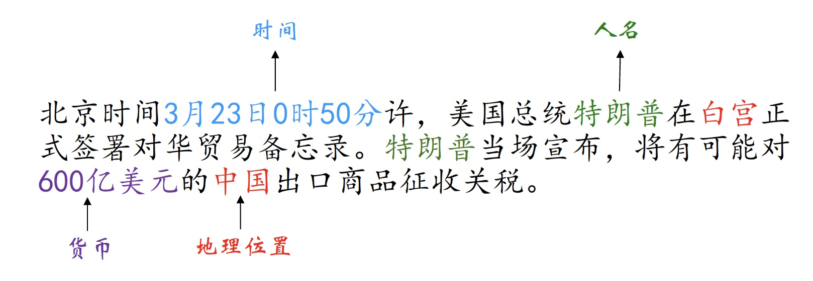

# 目录

- [1. 实体识别的基本概念](#1-实体识别的基本概念)
- [2. 基于规则和词典的方法](#2-基于规则和词典的方法)
- [3. 基于机器学习的方法](#3-基于机器学习的方法)
- [4. 基于深度学习的方法](#4-基于深度学习的方法)
  - [4.1 Pytorch版中文命名体识别-BiLSTM+CRF](#41-Pytorch版中文命名体识别-BiLSTM+CRF)
- [5. 基于半监督学习的方法](#5-基于半监督学习的方法)
- [6. 基于迁移学习的方法](#6-基于迁移学习的方法)
- [7. 基于预训练的方法](#7-基于预训练的方法)

## 1. 实体识别的基本概念

### 1.1 实体识别的任务是识别出文本中三大类命名实体（实体类，时间类，数字类），具体如下：

- 实体类：人名、组织/机构、地理位置
- 时间类：时间、日期
- 数字类：货币、百分比
- ......

### 1.2 示例如下

### 1.3 序列标注体系

| Toke  | IO | BIO | BIOES    | BMEWO |
| ----- | --- | --- | ------- | ----- |
| 特 | I-PER | B-PER | B-PER | B-PER |
| 朗 | I-PER | I-PER | I-PER | M-PER |
| 普 | I-PER | I-PER | E-PER | E-PER |
| 在 | O     | O     | O     | O     |
| 白 | I-LOC | B-LOC | B-LOC | B-LOC |
| 宫 | I-LOC | I-LOC | E-LOC | E-LOC |
| 签 | O     | O     | O     | O     |
| 署 | O     | O     | O     | O     |

## 2. 基于规则和词典的方法

- 1.预处理
  - 1.1 划分句子
  - 1.2 分词+词性标注
  - 1.3 构建词典
- 2.识别实体边界
  - 2.1 初始化边界：词典匹配、拼写规则、特殊字符、特征词和标点符号等
- 3.命名实体分类 
  - 使用分类规则
  - 基于词典的分类

## 3. 基于机器学习的方法

### 3.1.隐马尔科夫模型（Hidden Markov Model, HMM）

### 3.2.最大熵马尔科夫模型（Maximum Entropy Markov Model, MEMM）

### 3.3.条件随机场（Condition Random Fields, CRF）

### 3.4.支持向量机（Support Vector Machine, SVM）

## 4. 基于深度学习的方法

### 4.1 Pytorch版中文命名体识别-BiLSTM+CRF
